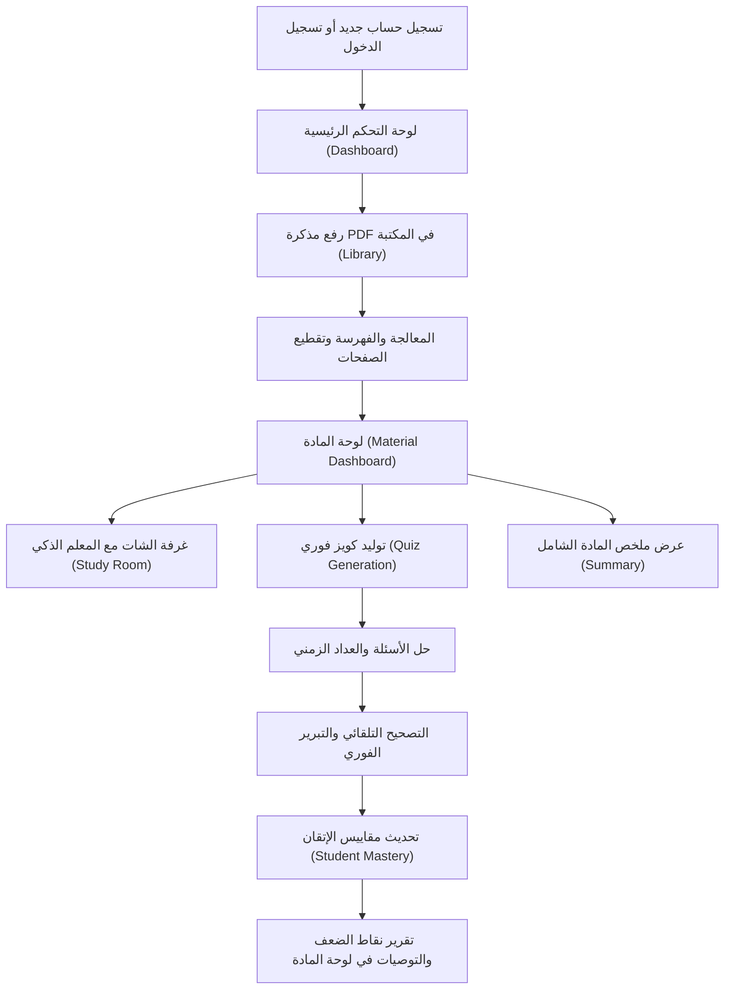
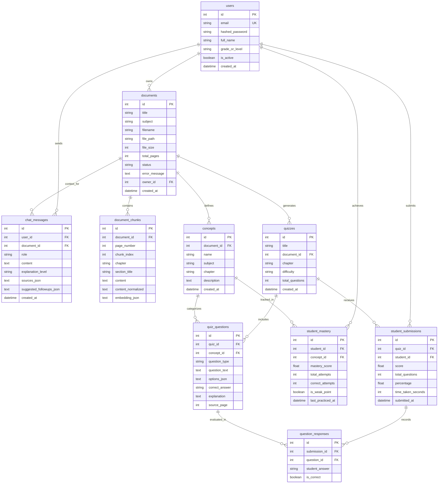

# تقرير التحليل الشامل والتدقيق الفني لمنصة StudyMind AI 🧠📚

تم إجراء فحص دقيق وشامل لكافة ملفات الكود المصدري للمشروع الحالي (**Backend** و **Frontend** و **Database Models** و **API Endpoints** و **AI Services** واختبارات **Pytest** وملفات الـ **Deployment**). 

هذا التقرير مبني **حصرًا** على الكود الفعلي الموجود في المستودع بدون أي تخمين أو افتراض لوجود ميزات غير مطبقة.

---

## 1. Project Overview

* **اسم المشروع**: **StudyMind AI** (محرك المذاكرة والتعلم الذكي للطلاب العرب - Arabic-First AI Study Engine).
* **فكرة المشروع**: منصة تعليمية ذكية تحول مذكرات وكتب الطالب المدرسية والجامعية بصيغة (PDF) إلى مدرس خصوصي تفاعلي يوثق إجاباته برقم الصفحة، ومولد اختبارات تفاعلي، ومحلل تكيفي لنقاط الضعف.
* **الهدف الأساسي**: استبدال الشات العام غير الموثوق بحل مبني على منهج الطالب الحقيقي (Grounded RAG)، مع الشرح بأربعة مستويات تبسيط، وتحديد نقاط الضعف والمفاهيم الحرجة لرفع مستوى التحصيل الأكاديمي.
* **الفئة المستهدفة**: طلاب المدارس (خاصة الثانوية العامة) والجامعات في العالم العربي.
* **أهم User Roles**:
  * **Student (طالب)**: الدور الفعلي الوحيد المبرمج في النظام حالياً.
  * *(Admin/Teacher/Parent: غير موجودة برمجياً ولا توجد حقول أدوار في قاعدة البيانات)*.
* **الـ Tech Stack**:
  * **Frontend**: Next.js 14 (App Router)، TypeScript، Tailwind CSS، Lucide React، Framer Motion.
  * **Backend**: FastAPI (Python 3.12 Asynchronous)، Pydantic v2، SQLAlchemy 2.0 (Async)، PyMuPDF (`fitz`)، `arabic-reshaper`، `python-bidi`.
  * **Database**: SQLite (محلياً عبر `aiosqlite`) كـ Fallback افتراضي جاهز للعمل، مع تكوين مسبق لـ PostgreSQL 16 مدعوماً بامتداد `pgvector` عبر Docker Compose.
  * **Authentication**: OAuth2 Password Flow + JWT Bearer Tokens (خوارزمية HS256) مع تشفير كلمات المرور باستخدام `bcrypt`.
  * **AI Models / AI APIs**:
    * **Groq API** (المزود الأساسي السريع: `openai/gpt-oss-120b` مع مصفوفة Fallback تلقائية تشمل `groq/compound`، `allam-2-7b`، `qwen/qwen3.6-27b`).
    * **Google Gemini API** (`gemini-1.5-flash` وموديل `text-embedding-004`).
    * **OpenRouter API** (`meta-llama/llama-3.3-70b-instruct:free`).
    * **Ollama** (للتشغيل المحلي للنماذج مثل `qwen2.5:7b`).
  * **External APIs**: واجهات الـ LLMs المذكورة أعلاه فقط (لا توجد بوابات دفع، ولا بريد إلكتروني خارجي).
  * **Storage**: التخزين المحلي على القرص الصلب لنظام التشغيل (`./uploads`).
  * **Deployment configuration**: `Dockerfile` (Python 3.12-slim)، `docker-compose.yml` (PostgreSQL + pgvector)، `render.yaml` (FastAPI Web Service على سحابة Render)، `Procfile`، وملفات تشغيل ويندوز (`Start_StudyMind.bat`).

---

## 2. جدول جميع الـ Features الموجودة في المشروع

| Feature | Status | Description | User Flow | Files/Components | API/Database |
| :--- | :---: | :--- | :--- | :--- | :--- |
| **تسجيل الحساب (Register)** | **Complete** | إنشاء حساب طالب جديد مع تشفير كلمة المرور | إدخال الاسم، البريد، كلمة المرور -> إنشاء المستخدم في DB | [page.tsx](file:///d:/proj/frontend/src/app/page.tsx), [auth.py](file:///d:/proj/backend/app/api/v1/auth.py) | `POST /api/v1/auth/register` `users` table |
| **تسجيل الدخول (Login)** | **Complete** | التحقق من المستخدم وإصدار JWT Token صالح لـ 24 ساعة | إدخال البريد وكلمة المرور -> حفظ التوكن في localStorage -> تحويل للـ Dashboard | [page.tsx](file:///d:/proj/frontend/src/app/page.tsx), [api.ts](file:///d:/proj/frontend/src/lib/api.ts) | `POST /api/v1/auth/login` `users` table |
| **حذف الحساب نهائياً** | **Complete** | مسح حساب المستخدم مع كافة ملفاته ومحادثاته واختباراته | الملف الشخصي -> زر حذف الحساب -> نافذة تأكيد -> مسح كامل | [profile/page.tsx](file:///d:/proj/frontend/src/app/profile/page.tsx), [navbar.tsx](file:///d:/proj/frontend/src/components/navbar.tsx) | `DELETE /api/v1/auth/me` Cascade Delete |
| **رفع كتب الـ PDF** | **Complete** | رفع ملف PDF واستخراج نصوصه وفهرسته | المكتبة -> زر رفع -> اختيار ملف وعنوان ومادة -> معالجة | [library/page.tsx](file:///d:/proj/frontend/src/app/library/page.tsx), [documents.py](file:///d:/proj/backend/app/api/v1/documents.py) | `POST /api/v1/documents/upload` `documents`, `document_chunks` |
| **معالجة النصوص العربية** | **Complete** | تنظيف وتطبيع النص العربي وحذف التشكيل والزوائد | تلقائي عند رفع الملف أو البحث الدلالي | [arabic_nlp.py](file:///d:/proj/backend/app/services/arabic_nlp.py) | دوال مساعدة في الذاكرة |
| **عارض صفحات الكتاب** | **Complete** | استعراض نصوص صفحات المذكرة صفحة بصفحة داخل غرفة الشات | شاشة المذاكرة -> العمود الأيمن -> تقليب الصفحات | [study/[id]/page.tsx](file:///d:/proj/frontend/src/app/study/%5Bid%5D/page.tsx) | `GET /api/v1/documents/{id}/chunks` |
| **المعلم الذكي (AI Tutor Chat)** | **Complete** | شات RAG مخصص يجيب بنص واضح موثق برقم الصفحة مع أسئلة متابعة | يكتب الطالب سؤاله -> يبحث الـ RAG -> يولد المعلم الشرح | [study/[id]/page.tsx](file:///d:/proj/frontend/src/app/study/%5Bid%5D/page.tsx), [rag_engine.py](file:///d:/proj/backend/app/services/rag_engine.py) | `POST /api/v1/tutor/ask` `chat_messages` |
| **سجل الشات المستمر** | **Complete** | حفظ المحادثات في قاعدة البيانات واسترجاعها ومسحها | يفتح الطالب المادة فيجد شاته السابق، أو يضغط زر "مسح المحادثة" | [study/[id]/page.tsx](file:///d:/proj/frontend/src/app/study/%5Bid%5D/page.tsx), [tutor.py](file:///d:/proj/backend/app/api/v1/tutor.py) | `GET /tutor/history/{id}` `DELETE /tutor/history/{id}` |
| **مستويات الشرح الأربعة** | **Complete** | التبديل بين (بسيط جداً - فاينمان، متوسط، نص الكتاب، متقدم) | أزرار اختيار أعلى الشات تغير برومبت الـ LLM فورياً | [study/[id]/page.tsx](file:///d:/proj/frontend/src/app/study/%5Bid%5D/page.tsx), [rag_engine.py](file:///d:/proj/backend/app/services/rag_engine.py) | `explanation_level` parameter |
| **تلخيص المادة الذكي** | **Complete** | توليد ملخص شامل للمادة مقسم لنقاط رئيسية مع إمكانية نسخه | لوحة المادة -> زر "تلخيص شامل" -> نافذة ملخص -> نسخ | [material/[id]/page.tsx](file:///d:/proj/frontend/src/app/material/%5Bid%5D/page.tsx), [rag_engine.py](file:///d:/proj/backend/app/services/rag_engine.py) | `POST /api/v1/tutor/summary/{id}` |
| **توليد الكويزات التفاعلية** | **Complete** | توليد أسئلة اختيار من متعدد / صح وخطأ موثقة برقم الصفحة | اختيار الصعوبة وعدد الأسئلة -> توليد JSON -> بدء الاختبار | [quizzes/page.tsx](file:///d:/proj/frontend/src/app/quizzes/page.tsx), [quiz_generator.py](file:///d:/proj/backend/app/services/quiz_generator.py) | `POST /api/v1/quizzes/generate` `quizzes`, `quiz_questions` |
| **التصحيح التلقائي والتبرير** | **Complete** | تصحيح فوري لإجابات الطالب مع عرض تفسير علمي ورقم الصفحة | الإجابة على الأسئلة -> إنهاء الاختبار -> تقرير بالدرجة والحلول | [quiz/[id]/page.tsx](file:///d:/proj/frontend/src/app/quiz/%5Bid%5D/page.tsx), [quiz_generator.py](file:///d:/proj/backend/app/services/quiz_generator.py) | `POST /api/v1/quizzes/{id}/submit` `student_submissions` |
| **تشخيص نقاط الضعف والمفاهيم** | **Complete** | تتبع نسبة إتقان كل مفهوم (Concept Mastery) وتصنيف الضعيف والقوي | عند تصحيح الكويز يتم تحديث `student_mastery` وحساب نسبة الإتقان | [adaptive_engine.py](file:///d:/proj/backend/app/services/adaptive_engine.py), [material/[id]/page.tsx](file:///d:/proj/frontend/src/app/material/%5Bid%5D/page.tsx) | `concepts`, `student_mastery` `GET /api/v1/analytics/document/{id}` |
| **تحدي اليوم السريع (60 ثانية)** | **Complete** | جلب سؤال عشوائي يومي من مذكرات الطالب في الـ Dashboard وتصحيحه فورياً | فتح لوحة التحكم -> اختيار خيار -> ظهور النتيجة والتفسير فوراً | [dashboard/page.tsx](file:///d:/proj/frontend/src/app/dashboard/page.tsx), [quizzes.py](file:///d:/proj/backend/app/api/v1/quizzes.py) | `GET /api/v1/quizzes/challenge/quick` |
| **قائمة المهام اليومية (To-Do)** | **Basic** | قائمة أهداف دراسية يومية مع شريط نسبة إنجاز مئوي | إضافة مهمة -> تعليم كمنجزة -> شريط إنجاز وحفظ محلي | [dashboard/page.tsx](file:///d:/proj/frontend/src/app/dashboard/page.tsx) | مخزنة في `localStorage` فقط |
| **نصائح المذاكرة اليومية** | **Basic** | كروت نصائح علمية حول تقنيات الاستذكار تتغير عشوائياً | استعراض النصيحة على الـ Dashboard مع زر تبديل | [dashboard/page.tsx](file:///d:/proj/frontend/src/app/dashboard/page.tsx) | كود ثابت في الواجهة (Client-side) |
| **البحث والتصفية في المكتبة** | **Complete** | فلترة المذكرات حسب المادة والاسم والبحث الفوري | إدخال كلمة في شريط البحث أو اختيار تصنيف المادة | [library/page.tsx](file:///d:/proj/frontend/src/app/library/page.tsx) | Client-side Filtering |
| **استئناف المذاكرة (Jump Back In)** | **Basic** | إبراز آخر مذكرة تم رفعها/الوصول إليها للمتابعة السريعة | زر مباشر على الـ Dashboard للدخول للمذكرة السابقة | [dashboard/page.tsx](file:///d:/proj/frontend/src/app/dashboard/page.tsx) | يعتمد على أول عنصر في قائمة المستندات |
| **أيام الحماسة والمذاكرة (Streak)** | **Basic** | احتساب الأيام الفريدة التي أجرى فيها الطالب اختبارات | تظهر في لوحة التحكم والملف الشخصي بعدد الأيام | [adaptive_engine.py](file:///d:/proj/backend/app/services/adaptive_engine.py) | `COUNT(DISTINCT DATE(submitted_at))` |
| **نظام الصلاحيات والأدوار** | **Missing** | لا توجد أدوار (مثل Admin, Teacher) | غير موجود | [models/user.py](file:///d:/proj/backend/app/models/user.py) | غير مدعوم في الـ DB |
| **استعادة كلمة المرور** | **Missing** | لا يوجد رابط "نسيت كلمة المرور" أو إرسال OTP | غير موجود | [auth.py](file:///d:/proj/backend/app/api/v1/auth.py) | غير موجود |
| **دعم ملفات Word أو الصور** | **Missing** | التحقق يرفض أي ملف غير `.pdf` | غير موجود | [documents.py](file:///d:/proj/backend/app/api/v1/documents.py) | يرمي HTTP 400 |
| **التعرف الضوئي OCR** | **Missing** | الـ PDF الممسوح ضوئياً يكتشف فقط كـ `is_scanned` دون تحويله لنص | غير موجود | [pdf_extractor.py](file:///d:/proj/backend/app/services/pdf_extractor.py) | لا يوجد محرك Tesseract أو Vision |

---

## 3. AI Features Audit

| AI Feature | هل هي موجودة؟ | تعمل فعلياً أم UI فقط؟ | النموذج المستخدم (Model) | الـ API المستخدمة | أين يتم تنفيذها؟ | حدودها الحالية |
| :--- | :---: | :---: | :--- | :--- | :--- | :--- |
| **AI Chat (شات عام)** | ❌ غير موجودة | — | تم استبدالها بـ Chat مقيد بالمنهج | — | — | مصمم عمداً لمنع الشات العام بدون مذكرات |
| **Chat with PDF** | ✅ نعم | تعمل فعلياً بنسبة 100% | `openai/gpt-oss-120b` (أو `gemini-1.5-flash`) | Groq API / Google Gemini | [rag_engine.py](file:///d:/proj/backend/app/services/rag_engine.py) | تعتمد على النصوص الرقمية فقط (وليس الصور الممسوحة) |
| **RAG (Retrieval-Augmented Generation)** | ✅ نعم | تعمل فعلياً | Lexical BM25 + Embeddings (`text-embedding-004`) | Gemini / Groq / In-Memory BM25 | [vector_store.py](file:///d:/proj/backend/app/services/vector_store.py) | يتم حساب BM25 في ذاكرة الباك إند بافتراض أحجام مذكرات دراسية معقولة |
| **Document Analysis** | ✅ نعم | تعمل فعلياً | PyMuPDF + Arabic Normalizer | معالجة محلية | [pdf_extractor.py](file:///d:/proj/backend/app/services/pdf_extractor.py) | تقرأ النصوص وتحسب عدد الصفحات والفقرات ونسبة المسح الضوئي |
| **Summarization (التلخيص)** | ✅ نعم | تعمل فعلياً | LLM Pool (Groq / Gemini) | Groq / Gemini API | [rag_engine.py:L199](file:///d:/proj/backend/app/services/rag_engine.py#L199) | تأخذ أول 6 Chunks من بداية المذكرة لتلخيصها منعاً لاستهلاك الـ Tokens |
| **Question Generation** | ✅ نعم | تعمل فعلياً | Groq (`gpt-oss-120b`) مع Fallback محلي ذكي | Groq / In-Memory Sentences | [quiz_generator.py](file:///d:/proj/backend/app/services/quiz_generator.py) | تولد أسئلة بنظام JSON مع التحقق الصارم من الخيارات |
| **MCQ Generation** | ✅ نعم | تعمل فعلياً | LLM أو الجمل الأكاديمية المستخرجة | Groq / Local Sentences | [quiz_generator.py](file:///d:/proj/backend/app/services/quiz_generator.py) | تصيغ 4 خيارات حقيقية من سياق الدرس لمنع الهلوسة |
| **Essay Questions** | ❌ غير موجودة | — | غير موجود دليل عليها في الكود | — | — | النظام يدعم MCQ و True/False فقط |
| **Flashcards (بطاقات)** | ❌ غير موجودة | — | لم أجد دليلاً عليها في الكود | — | — | توجد كروت الـ 3D في صفحة الهبوط فقط كشرح توضيحي |
| **Exam Generation** | ✅ نعم | تعمل فعلياً | LLM بمستوى صعوبة `exam` | Groq / Gemini | [quiz_generator.py](file:///d:/proj/backend/app/services/quiz_generator.py) | يعتمد على فصول وصفحات المذكرة |
| **Automatic Grading** | ✅ نعم | تعمل فعلياً | مطابقة برمجية دقيقة + تبرير الـ AI | Python Backend Engine | [quiz_generator.py:L334](file:///d:/proj/backend/app/services/quiz_generator.py#L334) | تصحيح فوري وحساب النسبة المئوية بدقة كاملة |
| **Personalized Learning** | 🟡 جزئياً (Partial) | تعمل فعلياً | قواعد إحصائية تكيفية | Python Engine | [adaptive_engine.py](file:///d:/proj/backend/app/services/adaptive_engine.py) | يحدد نقاط القوة والضعف ويصيغ خطة، لكنه لا يغير صعوبة الاختبار تلقائياً |
| **Weakness Detection** | ✅ نعم | تعمل فعلياً | نسبة إتقان المفاهيم أقل من 70% | Python Algorithm | [adaptive_engine.py](file:///d:/proj/backend/app/services/adaptive_engine.py) | دقيقة جداً ومربوطة بجدول `student_mastery` |
| **Study Plan** | 🟡 جزئياً (Partial) | تعمل فعلياً | محرك قواعد بناءً على نقاط الضعف | Python Algorithm | [adaptive_engine.py:L94](file:///d:/proj/backend/app/services/adaptive_engine.py#L94) | نصوص توصيات ذكية موجهة للمفاهيم الحرجة، وليست جدول تقويم زمني |
| **AI Tutor** | ✅ نعم | تعمل فعلياً | LLM مع برومبت تربوي صارم بـ 4 مستويات | Groq / Gemini / Ollama | [rag_engine.py](file:///d:/proj/backend/app/services/rag_engine.py) | ممنوع من الهلوسة وملزم بذكر رقم الصفحة في السطر الأخير |
| **Voice Features** | ❌ غير موجودة | — | لم أجد دليلاً عليها في الكود | — | — | لا توجد مكتبات صوتية في الباك إند أو الفرونت إند |
| **Speech-to-Text** | ❌ غير موجودة | — | غير موجودة | — | — | لا يوجد تسجيل ميكروفون |
| **Text-to-Speech** | ❌ غير موجودة | — | غير موجودة | — | — | لا يوجد قارئ صوتي |
| **Translation** | ❌ غير موجودة | — | غير موجودة كميزة منفصلة | — | — | التركيز منصب كلياً على المحتوى العربي الأصلي |
| **Image Understanding** | ❌ غير موجودة | — | غير موجودة في الـ Endpoints الحالية | — | — | يتم إرسال نصوص فقط لموديل الـ LLM |
| **OCR (التعرف الضوئي)** | ❌ غير موجودة | — | لم أجد دليلاً عليها في الكود | — | — | الملفات الممسوحة ضوئياً لا يتم استخراج نصوصها |

---

## 4. Student Experience Audit

تحليل مسار رحلة الطالب عبر خطواتها الفعلية:

### تقييم مراحل التجربة:
* **ما هو الموجود ويعمل بتناسق؟**
  * التسجيل والدخول وحفظ الـ Token في المتصفح.
  * الانتقال للوحة التحكم وعرض الإحصائيات الحقيقية.
  * رفع الملفات ومعالجتها وظهور عدد صفحاتها وحالتها `indexed`.
  * التنقل بين عارض صفحات المذكرة والشات مع المدرس الذكي في شاشة واحدة مقسمة.
  * توليد الاختبار من واقع نصوص الكتاب، وحل الأسئلة، وظهور تقرير النتيجة مع التفسير وأرقام الصفحات.
  * تسجيل نتائج كل سؤال ومفهوم في جدول `student_mastery` وانعكاسها فوراً على لوحة المادة والملف الشخصي.
* **ما هو الناقص؟**
  * **الخطوات غير المترابطة**: عند انتهاء الاختبار، يظهر زر "الرجوع لغرفة المذاكرة" وزر "لوحة التحكم"، لكن لا يوجد زر "بدء كويز علاجي فوري يقتصر فقط على الأسئلة التي أخطأ فيها الطالب" بالرغم من أن الـ Recommendation تنصح بذلك.
  * لا توجد خطوة وسيطة لعرض شجرة محتويات الكتاب (فهرس الأبواب) لاختيار باب محدد للدراسة، بل يتم تقليب الصفحات رقمياً فقط.
  * خطة المذاكرة (Study Plan) عبارة عن قائمة نصائح موجهة وليس تقويماً دراسياً يمكن التفاعل معه أو تحديد تواريخه.

---

## 5. Dashboard Audit

عناصر لوحة التحكم المستخرجة من الكود الفعلي ([dashboard/page.tsx](file:///d:/proj/frontend/src/app/dashboard/page.tsx)):

* **Statistics**:
  * عدد أيام المذاكرة والحماسة (`streak_days`).
  * نسبة الإتقان العام (`average_score`).
  * إجمالي الأسئلة المحلولة (`total_questions_answered`).
  * إجمالي الكتب والمذكرات المرفوعة (`total_documents`).
* **Progress**: شريط نسبة إنجاز أهداف اليوم اليومية (To-Do Progress Bar).
* **Courses**: *غير موجود ككيان منفصل* (الموجود هو مذكرات وكتب فقط).
* **Subjects**: تصنيف المادة موجود كحقل نصي ملحق بكل مذكرة (مثل "الفيزياء"، "الكيمياء") وليس جدولاً مستقلاً.
* **Recent Activity / Jump Back In**: كارت استئناف المذاكرة يعرض آخر مذكرة تم فتحها/رفعها مع أزرار للمتابعة الفورية.
* **Exams & Quizzes**: زر الانتقال السريع لسجل الاختبارات، مع عرض إجمالي الكويزات المنجزة.
* **Weak Topics**: يتم عرضها في صفحة المادة التفصيلية وفي صفحة الملف الشخصي (Profile).
* **Study Streak**: موجود ويعمل برمجياً بحساب الأيام الفريدة لحل الكويزات.
* **Study Time (عداد وقت المذاكرة)**: *غير موجود في الـ Dashboard* (الموجود هو فقط `time_taken_seconds` داخل شاشة الكويز).
* **Recommendations**: كارت "نصيحة المعلم الذكي اليومية" (4 نصائح تربوية للاستذكار بتقنيات فاينمان والتكرار المتباعد).
* **Notifications**: *غير موجودة / لم أجد دليلاً عليها*.
* **Calendar**: *غير موجودة / لم أجد دليلاً عليها*.
* **Goals**: قائمة مهام يومية تفاعلية تمكن الطالب من إضافة أهدافه وعمل Check عليها ومسحها.

---

## 6. File & Document System Audit

* **PDF Upload**: ✅ موجود ويعمل عبر مكتبة PyMuPDF (`fitz`).
* **Word Upload (.docx)**: ❌ غير مدعوم برمجياً (يرفض النظام الملف برمز خطأ 400).
* **Images Upload**: ❌ غير مدعوم.
* **Multiple Files Upload**: ❌ غير مدعوم؛ الرفع يتم لملف واحد في كل مرة.
* **File Validation**: 🟡 جزئي؛ يتحقق فقط من امتداد اسم الملف `.endswith(".pdf")` دون فحص الـ MIME type أو الـ Magic Bytes.
* **File Size Limits**: ❌ غير محدد بحد أقصى على السيرفر؛ يتم استدعاء `await file.read()` بالكامل في الذاكرة.
* **OCR**: ❌ غير موجود؛ يكتشف فقط نسبة الصفحات الفارغة وإذا زادت عن 60% يضع مؤشر `is_scanned: True` دون استخراج نصوص منها.
* **Text Extraction**: ✅ ممتاز؛ يستخرج النصوص صفحة بصفحة مع حفظ أرقام الصفحات الحقيقية.
* **Document Chunking**: ✅ ممتاز؛ تقطيع دلالي عربي مخصص (`chunk_arabic_document`) يكتشف العناوين (الباب، الفصل، الدرس) ويحافظ على أرقام الصفحات مع تداخل (Overlap).
* **Embeddings**: 🟡 جزئي؛ يدعم التوليد عبر Gemini `text-embedding-004` و Ollama، ولديه نظام Fallback مشفر ذكي، ولكنه يُخزن كـ `JSON text` في عمود `embedding_json`.
* **Vector Database**: 🟡 جزئي؛ تكوين الـ Docker يدعم `pgvector`، ولكن في بيئة SQLite الحالية يتم البحث عبر محرك **BM25 / Lexical Ranker** باللغة العربية.
* **Document Search**: ✅ موجود في الواجهة للبحث في المكتبة بالاسم والمادة والملف.
* **Delete Documents**: ❌ **غير موجود Endpoint مخصص لحذف مذكرة معينة بشكل فردي** (الموجود فقط هو حذف الحساب بالكامل وحذف ملفاته معه).
* **Organize Documents (مجلدات/تصنيفات)**: ❌ لا توجد مجلدات؛ تنظيم مسطح يعتمد على اسم المادة فقط.
* **Processing Status**: ✅ موجود بحالات (`processing`, `indexed`, `error`).
* **Error Handling**: ✅ عند فشل المعالجة يتم تحويل حالة المذكرة إلى `error` وتخزين رسالة الخطأ في `error_message`.

---

## 7. Quiz & Exam System Audit

* **MCQ (اختيار من متعدد)**: ✅ موجود ويعمل بدقة (4 خيارات مع خيار صحيح وثلاث مشتتات).
* **True/False (صح وخطأ)**: ✅ مدعوم في الـ Prompt ومولد الأسئلة.
* **Short Answer**: ❌ غير موجود.
* **Essay (أسئلة مقالية)**: ❌ غير موجود.
* **Question Bank (بنك أسئلة دائم)**: 🟡 جزئي؛ الأسئلة المولدة تُخزن في جدول `quiz_questions` وتُستدعى للتحدي اليومي، لكن لا توجد شاشة لإدارة بنك الأسئلة أو إضافة أسئلة يدوياً من قبل المعلم.
* **Random Questions**: ✅ موجود في ميزة "تحدي اليوم السريع" عبر `func.random()`.
* **Difficulty Levels**: ✅ موجودة بـ 4 مستويات (`easy`, `medium`, `hard`, `exam`).
* **Timer (العداد الزمني)**: 🟡 جزئي؛ عداد تصاعدي بالثواني في واجهة المستخدم يُسجل في قاعدة البيانات، لكن لا يوجد عداد تنازلي إجباري يُغلق الامتحان تلقائياً عند انتهاء الوقت.
* **Auto Grading**: ✅ ممتاز وفوري 100%.
* **Manual Grading**: ❌ غير موجود.
* **Explanations (تفسير الإجابات)**: ✅ موجود بنص المنهج ورقم الصفحة لكل سؤال.
* **Results (عرض النتيجة)**: ✅ شاشة نتائج مخصصة توضح النسبة المئوية والدرجة والوقت.
* **Review Answers**: ✅ شاشة مراجعة تفصيلية توضح إجابة الطالب مقابل الإجابة النموذجية وتبريرها.
* **Retry (إعادة الاختبار)**: 🟡 جزئي؛ يمكن توليد اختبار جديد في المادة، لكن لا يوجد زر "إعادة محاولة نفس الاختبار بالذات".
* **Score History**: ✅ صفحة كاملة ومخصصة لسجل الاختبارات السابقة والدرجات (`/quizzes`).
* **Exam Analytics**: ✅ احتساب متوسط الدرجات العام، ونسبة النجاح، وربط النتائج بالمفاهيم.

---

## 8. Gamification Audit

* **XP (نقاط الخبرة)**: ❌ غير موجودة / لم أجد دليلاً عليها في الكود.
* **Points**: ❌ غير موجودة كعملة أو رصيد مكافآت.
* **Levels (مستويات 1، 2، 3)**: ❌ غير موجودة (الموجود في البروفايل هو مؤشر "مستوى الفهم والاستيعاب المتوقع" المشتق من درجات الكويزات وليس مستوى ألعاب).
* **Badges (الأوسمة)**: ❌ غير موجودة في قاعدة البيانات (توجد فقط بادجات تصميمية ثابتة مثل "طالب نشط").
* **Achievements (الإنجازات)**: ❌ لا يوجد نظام لفتح الإنجازات (Achievements Unlocks).
* **Streaks (أيام المذاكرة المتتالية)**: ✅ موجود ويعمل برمجياً باحتساب عدد الأيام المختلفة التي أجرى فيها الطالب اختبارات في جدول `StudentSubmission`.
* **Leaderboards (لوحة الشرف/المتصدرين)**: ❌ غير موجودة (لا يوجد تنافس بين الطلاب).
* **Daily Goals (أهداف اليوم)**: ✅ موجودة وتعمل في الـ Dashboard مع تخزين في الـ `localStorage`.
* **Rewards (المكافآت)**: ❌ غير موجودة.
* **Progress Bars**: ✅ موجودة في بطاقات المهام اليومية، وصفحة نتيجة الكويز، والملف الشخصي.

---

## 9. Personalization Audit

| المعيار | هل النظام يعرفه؟ | هل يستخدمه فعلياً في تخصيص التجربة؟ |
| :--- | :---: | :--- |
| **مستوى الطالب (الصف الدراسي)** | ✅ مسجل | ❌ **لا يُستخدم حالياً**؛ حقل `grade_or_level` يُخزن في جدول المستخدم ويُعرض في البروفايل فقط، ولا يؤثر في برومبت الذكاء الاصطناعي. |
| **المواد التي يدرسها** | ✅ مسجل | 🟡 يُستخدم لتصنيف المذكرات وفلترتها في المكتبة وتجميع درجات الكويزات. |
| **نقاط ضعفه (Weak Points)** | ✅ مسجل | ✅ **يُستخدم فعلياً**؛ يتم تحديد أي مفهوم تقل نسبة إتقانه عن 70% وتوليد خطة مراجعة مخصصة له وإبرازه في لوحة المادة. |
| **نقاط قوته (Strong Points)** | ✅ مسجل | ✅ يُسجل في `StudentMastery` ويُعرض في لوحة المادة والبروفايل مع نسب الإتقان. |
| **تاريخ الاختبارات** | ✅ مسجل | ✅ يُستخدم لاحتساب الـ Streak والمتوسط الحسابي وتحديد تطور الأداء. |
| **مستوى الصعوبة المناسب** | 🟡 جزئياً | ❌ يختار الطالب الصعوبة يدوياً في كل مرة ولا يقوم النظام بفرض مستوى صعوبة تكيفي بناءً على أخطائه السابقة. |
| **وقت المذاكرة** | 🟡 جزئياً | ❌ يُسجل وقت حل الكويز فقط بالثواني، ولا يوجد تتبع لزمن جلسات القراءة والشات. |
| **أهداف الطالب** | 🟡 جزئياً | ❌ الأهداف تسجل كـ To-Do محلي في المتصفح فقط ولا يعرفها الـ AI Tutor. |

---

## 10. Authentication & Authorization Audit

* **Registration**: ✅ موجود عبر `POST /api/v1/auth/register` ويقوم بالتحقق من عدم تكرار البريد الإلكتروني.
* **Login**: ✅ موجود عبر `POST /api/v1/auth/login` بنظام OAuth2 Form Data ويُرجع JWT Token.
* **Logout**: ✅ موجود في الواجهة الأمامية عبر تفريغ الـ Token وبيانات المستخدم من `localStorage`.
* **Password Reset**: ❌ **غير موجودة كلياً** (لا توجد آلية استرجاع كلمة المرور عند نسيانها).
* **Email Verification**: ❌ **غير موجودة** (لا يتم إرسال رسالة تفعيل بريد؛ الحساب يُفعل فوراً `is_active = True`).
* **Sessions / Token Lifecycle**: 🟡 التوكن مدته 24 ساعة (1440 دقيقة)، ولا توجد آلية Refresh Token منفصلة.
* **Roles**: ❌ لا يوجد حقل للأدوار في جدول `users` (لا يوجد دور أدمن أو معلم).
* **Permissions**: 🟡 تعتمد على التحقق من أن المستخدم يملك الكائن (Ownership Check) قبل جلبه أو استخدامه.
* **Protected Routes**:
  * في الـ Backend: ✅ محمية عبر التبعية `get_current_user` في `deps.py`.
  * في الـ Frontend: 🟡 تعتمد على `useEffect` داخل كل صفحة لفحص الـ Token وتوجيه المستخدم، ولا يوجد `middleware.ts` على مستوى سيرفر Next.js.
* **Admin Access**: ❌ غير موجودة.
* **Student Access**: ✅ مفعلة بالكامل.

---

## 11. Database Schema & Models Audit

قاعدة البيانات تحتوي على **10 جداول** أساسية:

### بيانات مهمة غير محفوظة حالياً في قاعدة البيانات:
1. **جداول الكورسات والمناهج الرسمية**: لا يوجد جدول للكورسات؛ النظام يعتمد على مذكرات يرفعها الطالب فقط.
2. **جدول المهام اليومية (Daily Tasks)**: يُخزن حالياً في `localStorage` فقط ويضيع عند تبديل المتصفح أو الجهاز.
3. **وقت المذاكرة الفعلي**: لا يوجد تتبع لوقت فتح الشات وقراءة الصفحات.
4. **سجل الأحداث والأنشطة (Activity Log)**: لا يوجد جدول يسجل تاريخ فتح المذكرات أو التفاعلات.
5. **جدول الإشعارات والتنبيهات (Notifications)**: غير موجود.

---

## 12. Backend & APIs Inventory

قائمة بكافة الـ Endpoints الموجودة فعلياً في الباك إند:

### 1. المصادقة والحسابات (Auth)
* **`POST /api/v1/auth/register`**
  * **الغرض**: تسجيل طالب جديد.
  * **المصادقة**: مفتوح (Public).
  * **المدخلات (Body)**: `{ email, password, full_name, grade_or_level }`
  * **المخرجات**: كائن المستخدم المسجل `{ id, email, full_name, is_active, created_at }`.
* **`POST /api/v1/auth/login`**
  * **الغرض**: تسجيل الدخول والحصول على التوكن.
  * **المصادقة**: مفتوح (Public / OAuth2 Password Form).
  * **المدخلات (Form)**: `username` (البريد), `password`.
  * **المخرجات**: `{ access_token, token_type, user_id, full_name, email }`.
* **`GET /api/v1/auth/me`**
  * **الغرض**: جلب بيانات الملف الشخصي للمستخدم الحالي.
  * **المصادقة**: إجبارية (Bearer Token).
  * **المدخلات**: لا يوجد.
  * **المخرجات**: بيانات المستخدم الحالية.
* **`DELETE /api/v1/auth/me`**
  * **الغرض**: حذف الحساب نهائياً مع مسح كافة ملفاته من القرص وقاعدة البيانات.
  * **المصادقة**: إجبارية (Bearer Token).
  * **المدخلات**: لا يوجد.
  * **المخرجات**: `{ message: "تم حذف الحساب وجميع البيانات..." }`.

### 2. المذكرات والمستندات (Documents)
* **`POST /api/v1/documents/upload`**
  * **الغرض**: رفع كتاب PDF ومعالجته وتطبيعه وتقطيعه واستخراج مفاهيمه.
  * **المصادقة**: إجبارية (Bearer Token).
  * **المدخلات (Multipart/Form)**: `file` (PDF), `title`, `subject`.
  * **المخرجات**: كائن المستند `{ id, title, subject, total_pages, status, ... }`.
* **`GET /api/v1/documents/`**
  * **الغرض**: جلب قائمة المستندات الخاصة بالطالب الحالي فقط.
  * **المصادقة**: إجبارية (Bearer Token).
  * **المدخلات**: لا يوجد.
  * **المخرجات**: مصفوفة من المذكرات `List[DocumentResponse]`.
* **`GET /api/v1/documents/{document_id}`**
  * **الغرض**: جلب تفاصيل مذكرة معينة وإحصائيات أجزائها.
  * **المصادقة**: إجبارية (Bearer Token).
  * **المدخلات**: `document_id` (Path).
  * **المخرجات**: بيانات المذكرة التفصيلية مع `chunks_count`.
* **`GET /api/v1/documents/{document_id}/chunks`**
  * **الغرض**: استعراض أجزاء ونصوص المذكرة (مع إمكانية فلترة برقم الصفحة).
  * **المصادقة**: إجبارية (Bearer Token).
  * **المدخلات**: `document_id` (Path), `page` (Query, اختياري).
  * **المخرجات**: مصفوفة بنصوص الأجزاء وعناوين الأبواب `List[DocumentChunkResponse]`.

### 3. المعلم الذكي والشات (AI Tutor)
* **`POST /api/v1/tutor/ask`**
  * **الغرض**: سؤال المعلم الذكي وتوليد إجابة RAG موثقة برقم الصفحة وتخزينها في السجل.
  * **المصادقة**: إجبارية (Bearer Token).
  * **المدخلات (Body)**: `{ document_id, question, target_page, explanation_level, history }`.
  * **المخرجات**: `{ answer, explanation_level, sources: [...], suggested_followups: [...] }`.
* **`GET /api/v1/tutor/history/{document_id}`**
  * **الغرض**: استرجاع سجل المحادثة المحفوظ الخاص بالطالب لهذه المذكرة بالذات.
  * **المصادقة**: إجبارية (Bearer Token).
  * **المدخلات**: `document_id` (Path).
  * **المخرجات**: `{ document_id, total_messages, messages: [...] }`.
* **`DELETE /api/v1/tutor/history/{document_id}`**
  * **الغرض**: مسح سجل المحادثة لهذه المذكرة لبدء جلسة جديدة.
  * **المصادقة**: إجبارية (Bearer Token).
  * **المدخلات**: `document_id` (Path).
  * **المخرجات**: `{ message: "تم مسح سجل المحادثة بنجاح" }`.
* **`POST /api/v1/tutor/summary/{document_id}`**
  * **الغرض**: توليد ملخص بيداغوجي شامل للمادة مقسم لنقاط رئيسية.
  * **المصادقة**: إجبارية (Bearer Token).
  * **المدخلات**: `document_id` (Path).
  * **المخرجات**: `{ document_id, title, subject, total_pages, summary }`.

### 4. الاختبارات والتقييم (Quizzes)
* **`POST /api/v1/quizzes/generate`**
  * **الغرض**: توليد اختبار ذكي جديد من واقع صفحات المذكرة.
  * **المصادقة**: إجبارية (Bearer Token).
  * **المدخلات (Body)**: `{ document_id, chapter, target_page, difficulty, num_questions, question_type }`.
  * **المخرجات**: كائن الاختبار بالأسئلة والخيارات والصفحات `QuizResponse`.
* **`GET /api/v1/quizzes/{quiz_id}`**
  * **الغرض**: استرجاع بيانات وأسئلة اختبار محدد لخوضه.
  * **المصادقة**: إجبارية (Bearer Token).
  * **المدخلات**: `quiz_id` (Path).
  * **المخرجات**: تفاصيل الاختبار وقائمة الأسئلة وخياراتها.
* **`POST /api/v1/quizzes/{quiz_id}/submit`**
  * **الغرض**: تسليم إجابات الطالب وتصحيحها فوريًا وتحديث إتقان المفاهيم.
  * **المصادقة**: إجبارية (Bearer Token).
  * **المدخلات (Body)**: `{ time_taken_seconds, answers: [{ question_id, selected_answer }] }`.
  * **المخرجات**: `{ submission_id, score, percentage, passed, questions_feedback: [...] }`.
* **`GET /api/v1/quizzes/history/my`**
  * **الغرض**: استرجاع الأرشيف الكامل لكافة الاختبارات التي خاضها الطالب ونتائجها.
  * **المصادقة**: إجبارية (Bearer Token).
  * **المدخلات**: لا يوجد.
  * **المخرجات**: قائمة بمحاولات الاختبارات `List[QuizHistoryItem]`.
* **`GET /api/v1/quizzes/challenge/quick`**
  * **الغرض**: جلب سؤال عشوائي واحد من مذكرات الطالب لتحدي الـ 60 ثانية السريع.
  * **المصادقة**: إجبارية (Bearer Token).
  * **المدخلات**: لا يوجد.
  * **المخرجات**: سؤال التحدي مع خياراته وإجابته وتفسيره ومصدره.

### 5. الإحصائيات والتحليلات (Analytics)
* **`GET /api/v1/analytics/dashboard`**
  * **الغرض**: جلب مقاييس الأداء العامة للطالب ونقاط الضعف والقوة عبر كل المواد.
  * **المصادقة**: إجبارية (Bearer Token).
  * **المدخلات**: لا يوجد.
  * **المخرجات**: `{ total_documents, total_quizzes_taken, average_score, streak_days, weak_concepts, strong_concepts, recommended_revision_plan }`.
* **`GET /api/v1/analytics/document/{document_id}`**
  * **الغرض**: جلب تشخيص مستوى الطالب الخاص بمذكرة دراسية محددة.
  * **المصادقة**: إجبارية (Bearer Token).
  * **المدخلات**: `document_id` (Path).
  * **المخرجات**: إحصائيات ونقاط الضعف والمفاهيم الخاصة بتلك المادة فقط.

---

## 13. UI/UX Audit

* **Navigation**: ممتاز؛ شريط تنقل علوي ثابت (Desktop)، وقائمة منسدلة أنيقة للشاشات الصغيرة، مع شريط تنقل سفلي خاص بالهواتف (Mobile Bottom Bar) يُحاكي تطبيقات الهواتف الأصلية.
* **Responsive Design**: ممتاز؛ تم استخدام Grid و Flex متجاوبين بالكامل مع هواتف الشاشات الصغيرة وأجهزة التابلت والديسكتوب.
* **Mobile Experience**: مصمم بعناية؛ الشاشات الرئيسية مهيأة للأجهزة المحمولة مع إخفاء أشرطة التمرير المزعجة عبر كلاس `no-scrollbar`.
* **Accessibility**: متوسط؛ الأزرار تحتوي على عناوين ونصوص وأيقونات دلالية، لكن ينقص بعض وسوم `aria-label` وتباين الألوان في بعض النصوص الرمادية الفاتحة.
* **Loading States**: متوفرة في كافة الأزرار والصفحات عبر سبينرات `Loader2` مع رسائل إيضاحية عربية مشجعة.
* **Empty States**: مصممة بشكل احترافي مع أيقونات ورسائل توجيهية عند خلو المكتبة، أو سجل الاختبارات، أو قائمة المهام.
* **Error States**: معالجة أخطاء الشبكة والمدخلات مع رسائل تنبيهية باللون الأحمر الوردي في استمارات الدخول والاختبارات.
* **Notifications**: لا توجد مكتبة Toast Notifications (مثل `react-hot-toast` أو `sonner`)، حيث يتم الاكتفاء بتنبيهات مضمنة في الشاشة (Inline Banners) أو `alert()` في مواضع نادرة.
* **Forms**: مصممة بخطوط عربية واضحة، وحقول محمية برموز، وتحقق مسبق.
* **Search & Filters**: موجودة في شاشة المكتبة لتصفية المواد والكتب والبحث الفوري.
* **Dark Mode**: ❌ **غير موجود**؛ المنصة تعمل بالوضع الفاتح (Light Mode) حصراً.
* **Arabic RTL**: ✅ **مدعوم بنسبة 100%**؛ تم ضبط الاتجاه `dir="rtl"` في ملف الـ `layout.tsx` والخط الافتراضي هو خط **Cairo** العربي الجميل.
* **English LTR & Localization (i18n)**: ❌ النظام مصمم كـ Arabic-First ولا توجد ملفات ترجمة i18n للتحويل للغة الإنجليزية.

---

## 14. Security Audit

* **Authentication Weaknesses**:
  * لا توجد سياسة تعقيد لكلمة المرور (يمكن إنشاء حساب بكلمة مرور قصيرة).
  * لا يوجد تحديد لعدد محاولات تسجيل الدخول الفاشلة (مما يفتح الباب لهجمات Brute Force).
* **Authorization Issues & IDOR**:
  * تم فحص الـ Endpoints وتبين وجود حماية IDOR جيدة على مستوى فحص الملكية (`doc.owner_id == user.id` و `ChatMessage.user_id == user.id`).
  * ثغرة في جلب أسئلة الاختبار `GET /quizzes/{quiz_id}`: يتم التحقق من ملكية المذكرة التابع لها الاختبار، ولكن جدول `quiz_questions` يحتوي على `correct_answer` و `explanation` يتم إرسالها لـ Endpoint تصحيح الإجابات ولا ترسل في واجهة الاختبار قبل الحل، وهو تصميم سليم.
* **CORS Configuration**: ⚠️ **مشكلة أمنية حرجة**:
  * في [main.py:L25](file:///d:/proj/backend/app/main.py#L25) تم تفعيل `allow_origins=["*"]` مع `allow_credentials=True`. في متصفحات الويب الحديثة، هذا الإعداد يتعارض وقد يسمح باستغلال طلبات CSRF إذا تم استخدام Cookies، لكن النظام يستخدم Bearer Token في الترويسات مما يقلل الخطر نسبياً.
* **API Key Exposure**: ✅ ممتاز؛ المفاتيح (`GROQ_API_KEY`, `GEMINI_API_KEY`, `SECRET_KEY`) تقرأ من متغيرات البيئة عبر Pydantic Settings ولا يتم تسريبها للفرونت إند.
* **Prompt Injection**: 🟡 متوسط؛ تم وضع تعليمات صارمة في الـ System Instruction لمنع الهلوسة والالتزام بنص الكتاب، ولكن مدخلات الطالب في حقل `question` تُدمج مباشرة في الـ Prompt دون فلترة للعبارات التوجيهية (مثل "تجاهل التعليمات السابقة").
* **File Upload Vulnerabilities**: ⚠️ **مشكلة أمنية**:
  * يتم فحص الامتداد الشكلي فقط `.endswith(".pdf")`.
  * لا يتم فحص المحتوى الحقيقي للملف (Magic Bytes / MIME Sniffing).
  * لا يوجد حد أقصى لحجم الملف المرفوع على مستوى الكود، مما قد يستهلك ذاكرة السيرفر في حال رفع ملف عملاق (Denial of Service).
* **Path Traversal**: ✅ آمن؛ اسم الملف يُعاد توليده عبر `uuid.uuid4().hex_{file.filename}` ولا يُستخدم مسار العميل مباشرة.
* **Rate Limiting**: ❌ **غير موجود على الباك إند**؛ لا توجد طبقة حماية من استنزاف الـ API (مثل `slowapi`)، مما قد يؤدي لاستهلاك رصيد الـ LLM بسرعة إذا تكررت الطلبات.
* **SQL Injection**: ✅ محمي بالكامل؛ يعتمد المشروع على SQLAlchemy 2.0 المتوافقة مع استعلامات ORM المجهزة والمعلمة (Parameterized Queries).

---

## 15. Performance Audit

* **Frontend Performance**: خفيف وسريع جداً، تم بناؤه باستخدام Next.js 14 App Router مع Tailwind CSS ولا توجد مكتبات ضخمة تعيق التحميل.
* **API Latency**:
  * استجابة العمليات العادية (Auth, Documents metadata, History) فورية وتأخذ أقل من 50ms.
  * عمليات الذكاء الاصطناعي (Chat, Quiz Generation, Summary): تعتمد على سرعة واجهة Groq فائقة السرعة (عادة بين 1.0 إلى 2.5 ثانية).
* **Database Queries**:
  * الاستعلامات تستخدم الفهارس المناسبة على `user_id` و `document_id` ومفاتيح الربط الخارجية.
  * تم استخدام `selectinload` في علاقات الكويزات لتفادي مشكلة $N+1$ في الاستعلامات.
* **File Processing & Chunking**:
  * استخراج النصوص سريع بفضل محرك C المدمج في `PyMuPDF`.
  * معالجة الملفات الكبيرة تتم بشكل تزامني أثناء رفع الملف (Synchronous within the request)، مما يعني أنه لو تم رفع كتاب من 500 صفحة، سيتأخر طلب الـ HTTP حتى تنتهي المعالجة بدلاً من معالجته في الخلفية (Background Task / Celery).
* **Caching**: ❌ غير مفعل؛ لا يوجد كاش للمصطلحات أو لتضمينات المتجهات (Redis).
* **Pagination**: 🟡 غير مطبق في قائمة المستندات أو سجل الاختبارات؛ يتم جلب كافة السجلات دفعة واحدة `res.scalars().all()`.
* **Large Document Handling**: النصوص تُقسم لمقتطفات، ولكن عند البحث في مستندات تتجاوز آلاف الصفحات، سيستهلك حساب BM25 في الذاكرة موارد ملحوظة ما لم يتم الانتقال كلياً لمحرك `pgvector` في قاعدة البيانات.

---

## 16. Production Readiness (تقييم الجاهزية للإنتاج من 10)

| المجال | التقييم | التبرير الواقعي بناءً على الكود |
| :--- | :---: | :--- |
| **Architecture (المعمارية)** | **8 / 10** | بنية معمارية نظيفة ومنظمة جداً (Clean Layered Architecture) تفصل الـ APIs والخدمات والـ Schemas والموديلات، مع اعتماد Next.js App Router في الواجهة. |
| **Scalability (قابلية التوسع)** | **5 / 10** | معالجة الملفات تتم بشكل متزامن داخل الـ API Request وتخزين الملفات يتم على القرص المحلي بدلاً من Object Storage (مثل S3/Cloudinary)، وغياب مهام الخلفية (Celery/RQ). |
| **Reliability (الموثوقية)** | **8 / 10** | وجود مصفوفة Fallback ذكية في الـ LLM Adapter (Groq -> Gemini -> OpenRouter -> Local Sentences) تحمي النظام من الانهيار عند انقطاع أي مزود. |
| **Security (الأمان)** | **6 / 10** | المصادقة قوية وحماية IDOR متوفرة، ولكن غياب الـ Rate Limiting وفحص محتوى الملفات وسياسة تعقيد كلمات المرور يمثل نقاط ضعف. |
| **Error Handling (التعامل مع الأخطاء)** | **7 / 10** | معالجة استثناءات جيدة في معظم الـ Services مع تحويل حالة المذكرات إلى `error`، لكن بعض الأخطاء في الواجهة تعرض رسائل عامة للمستخدم. |
| **Observability & Monitoring** | **3 / 10** | لا يوجد دمج مع أدوات المراقبة وتتبع الأخطاء مثل Sentry أو OpenTelemetry أو Prometheus. |
| **Logging (سجلات النظام)** | **5 / 10** | استخدام مكتبة `logging` القياسية في بايثون مع رسائل Info و Warning جيدة، ولكن لا يوجد نظام تجميع مركزي للسجلات. |
| **Testing (الاختبارات الآلية)** | **7 / 10** | توجد اختبارات Pytest ممتازة وتغطي دورة المذاكرة الكاملة ومعالجة اللغة العربية ونجاحها 100%، لكن تغطية الواجهة (E2E Tests) غير موجودة. |
| **Backup (النسخ الاحتياطي)** | **2 / 10** | لا توجد استراتيجية أو سكريبتات آلية لأخذ نسخ احتياطية دورية من قاعدة البيانات والملفات المرفوعة. |
| **Deployment (الإعداد السحابي)** | **7 / 10** | توفر Dockerfile و docker-compose و render.yaml وسكريبتات ويندوز جاهزة تجعل النشر الأولي سهلاً للغاية. |
| **Environment Variables** | **9 / 10** | إدارة نموذجية عبر Pydantic Settings وملف `.env.example` موثق ومفصل بالكامل. |

---

## 17. قائمة الميزات الناقصة (Missing Features)

### 🔴 Critical Missing Features (ضرورية جدًا لاكتمال المنتج الأساسي)
1. **استعادة كلمة المرور (Forgot / Reset Password)**: غيابها يمنع أي مستخدم ينسى كلمة مروره من الوصول لمذكراته واختباراته.
2. **حذف وتنظيم المذكرات (Delete / Manage Documents)**: لا يمكن للطالب حالياً مسح مذكرة رفعها بالخطأ دون حذف حسابه بالكامل!
3. **تحديد سقف حجم الملفات وتأمين نوعها (File Upload Limits & MIME Validation)**: لحماية موارد السيرفر من الانهيار عند رفع ملفات ضخمة أو ملفات تنفيذية ضارة.
4. **تفعيل محرك التعرف الضوئي (OCR for Scanned Arabic PDFs)**: نسبة هائلة من مذكرات الطلاب في العالم العربي عبارة عن تصوير كاميرا أو مسح ضوئي ورقي، والنظام حالياً لا يستخرج نصوصها.
5. **معالجة الملفات في الخلفية (Background Processing / Queue)**: حتى لا يتجمد تطبيق الويب أثناء معالجة الكتب المدرسية الكبيرة (100+ صفحة).

### 🟠 Important Missing Features (مهمة جداً لتعزيز القيمة التعليمية)
6. **دعم استيراد المذكرات من وورد وصور (DOCX & Image Upload)**.
7. **كويزات علاجية تلقائية لنقاط الضعف (Targeted Remedial Quizzes)**: زر مباشر في لوحة المادة يولد اختباراً يحتوي حصراً على الأسئلة والمفاهيم التي رسب فيها الطالب سابقاً.
8. **تايمر إجباري للامتحان (Countdown Exam Timer)**: ضبط وقت محدد للامتحان مع إغلاق وتسليم تلقائي عند انتهاء الوقت لمحاكاة امتحانات الوزارة الحقيقية.
9. **حفظ المهام اليومية في قاعدة البيانات**: بدلاً من الـ `localStorage` لتظل متاحة للطالب عند فتح حسابه من هاتفه وحاسوبه.
10. **تحديد أقصى لطلبات الـ API (Rate Limiting)**: لحماية حسابات الذكاء الاصطناعي من الاستنزاف.

### 🟡 Nice to Have (ميزات إضافية وليست عاجلة)
11. **نظام التحفيز الكامل (XP Points, Badges, Levels)**: لمضاعفة رغبة الطالب في المذاكرة اليومية.
12. **المعلم الصوتي (Voice Tutor - STT & TTS)**: إمكانية نطق السؤال صوتياً وسماع الشرح بصوت عربي واضح.
13. **البطاقات التعليمية (Flashcards Deck)**: استخراج مصطلحات المذكرة في بطاقات مراجعة سريعة قبل ليلة الامتحان.
14. **المظهر الداكن (Dark Mode)**: لراحة عين الطالب أثناء المذاكرة الليلية.
15. **تصدير الملخصات والنتائج كملفات PDF قابلة للطباعة**.

---

## 18. Feature Completeness Matrix

| Category | Existing | Partial | Missing | Priority |
| :--- | :---: | :---: | :---: | :---: |
| **AI Features** | 7 | 3 | 5 | 🔴 High |
| **Documents System** | 6 | 2 | 4 | 🔴 High |
| **Exams & Quizzes** | 8 | 3 | 3 | 🟠 Medium |
| **Learning & Personalization** | 4 | 3 | 2 | 🔴 High |
| **Dashboard** | 7 | 2 | 3 | 🟡 Low |
| **Gamification** | 2 | 1 | 7 | 🟡 Low |
| **Authentication** | 4 | 1 | 3 | 🔴 High |
| **Security & Hardening** | 4 | 3 | 3 | 🔴 High |
| **UX & UI** | 8 | 2 | 2 | 🟠 Medium |

---

## 19. Product Score (التقييم الشامل من 100)

| المحور | الدرجة المستحقة | التبرير الفني والمنطقي |
| :--- | :---: | :--- |
| **Features** | **14 / 20** | الميزات الموجودة قوية وموجهة لهدفها، لكن ينقصها أدوات حيوية مثل مسح المذكرات، استعادة كلمة المرور، ودعم أنواع ملفات إضافية. |
| **AI Integration** | **17 / 20** | تطبيق متقن جداً للـ RAG مع مستويات الشرح الأربعة ومنع الهلوسة بصرامة والتوثيق برقم الصفحة، وتكامل مرن مع Groq و Gemini. |
| **UX / UI** | **13 / 15** | واجهة عربية أصيلة رائعة ومريحة للعين، استخدام جميل لخط Cairo، وتجاوب كامل مع الهواتف الذكية مع وجود شريط سفلي خاص بالهاتف. |
| **Learning Experience** | **12 / 15** | ربط رائع بين الاختبارات والمفاهيم وتشخيص دقيق لنقاط الضعف، ينقصه فقط توليد الكويز العلاجي بضغطة زر وتعيين خطة زمنية. |
| **Architecture** | **8 / 10** | بناء معياري أنيق (FastAPI + Next.js)، هيكلة واضحة للخدمات ونماذج البيانات، وجود بيئة اختبارات مؤتمتة. |
| **Security** | **6 / 10** | إدارة ممتازة لسرية الـ API Keys وحماية الـ IDOR والـ SQLi، لكن يعيبه الـ CORS المفتوح، غياب الـ Rate Limiting وفحص ملفات الرفع. |
| **Performance** | **4 / 5** | الواجهة سريعة وخفيفة واستجابة المعلم الذكي ممتازة عبر Groq، لكن تنقصه المعالجة الخلفية للملفات الكبيرة في السيرفر. |
| **Production Readiness** | **3.5 / 5** | النشر مجهز بملفات Docker و Render، لكن ينقصه تفعيل الـ Object Storage للسحابة وأدوات المراقبة المركزية والنسخ الاحتياطي. |
| **المجموع النهائي** | **77.5 / 100** | **منتج قوي ومميز في مرحلة (Advanced MVP) يتفوق تقنياً في الـ RAG العربي ويحتاج لخطوات إغلاق النواقص ليصبح منصة تجارية متكاملة.** |

---

## 20. Final Report

### What I already have (أهم ما يميز المشروع حالياً)
1. **محرك RAG عربي رصين وموثق**: إجابات مبنية 100% على صفحات كتاب الطالب مع الإحالة لرقم الصفحة الدقيق في السطر الأخير بدون ماركداون معقد.
2. **شات تفاعلي متعدد مستويات التبسيط**: إمكانية تغيير مستوى الشرح بين (بسيط جداً بأسلوب فاينمان، متوسط، مستوى كتاب الوزارة، متقدم).
3. **محرك امتحانات وتصحيح تكيفي**: توليد كويزات بمستويات صعوبة متنوعة مع تصحيح وتفسير فوري مستند للكتاب وتتبع استيعاب الطالب على مستوى المفاهيم (Concept Mastery).
4. **شاشة مذاكرة منقسمة (Split-Screen Workspace)**: تتيح تصفح صفحات المذكرة في جانب، ومحاورة المدرس الذكي في الجانب الآخر بتناغم تام.
5. **لوحة تحكم وتحليلات ذكية**: توفر متابعة دقيقة لأيام المذاكرة، وتحدياً يومياً سريعاً في 60 ثانية، وقائمة أهداف يومية، وتحديداً تلقائياً لنقاط القوة ونقاط الضعف.

### What is incomplete (ميزات موجودة لكن تحتاج تطوير)
1. **التخزين وقاعدة البيانات**: الاعتماد على SQLite محلياً وتخزين الملفات في مجلد محلي، وتخزين التضمينات كـ JSON نصي بدلاً من الاعتماد الدائم على محرك المتجهات `pgvector` وتخزين السحابة (S3).
2. **المعالج التكيفي (Adaptive Remediation)**: يكتشف نقاط الضعف بدقة لكنه لا يتيح بضغطة زر خوض "امتحان علاجي للأخطاء السابقة فقط".
3. **عداد وقت الاختبار**: يعمل كعداد وقت تصاعدي فقط ولا يقوم بسحب ورقة الامتحان إجبارياً بعد وقت محدد.
4. **تخزين المهام اليومية (To-Do)**: محفوظ في ذاكرة المتصفح المحلية فقط (`localStorage`).
5. **معالجة المذكرات الكبيرة**: تتم حالياً بشكل متزامن داخل طلب الرفع مما قد يتسبب في حدوث Timeout عند رفع كتب تتجاوز 100 صفحة.

### What is missing (أهم ما ينقص المشروع)
1. ميزة استعادة كلمة المرور وإرسال رسائل التأكيد بالبريد.
2. زر حذف أو تعديل مذكرات الطالب في المكتبة.
3. محرك التعرف الضوئي على الحروف (OCR) لاستيعاب المذكرات والكتب المصورة والممسوحة ضوئياً.
4. حماية السيرفر بـ Rate Limiting وفحص الـ MIME Types للملفات المرفوعة.
5. دعم مستندات Word وصور المذكرات.

---

### Top 10 Priorities (أهم 10 أولويات للبدء بها)

1. **إضافة Endpoint لحذف المذكرات** (`DELETE /api/v1/documents/{id}`) لإعطاء الطالب حرية تنظيف مكتبته.
2. **إضافة التحقق من نوع وحجم الملفات المرفوعة** (تحديد سقف 25MB مثلاً وفحص امتداد الـ PDF الحقيقي).
3. **إضافة ميزة استعادة كلمة المرور (Forgot Password Flow)** لحماية وصول الطلاب لحساباتهم.
4. **تطوير ميزة "كويز علاجي مركز"** في لوحة المادة، بحيث يولد الذكاء الاصطناعي أسئلة تركز تحديداً على الـ Weak Concepts المسجلة للطالب.
5. **نقل مهام معالجة الكتب لتعمل في الخلفية (FastAPI BackgroundTasks)** لمنع تجمد الواجهة أثناء رفع الكتب الطويلة.
6. **تعديل إعدادات الـ CORS** في [main.py](file:///d:/proj/backend/app/main.py) لتقتصر على نطاقات محددة لحماية المنصة.
7. **إضافة طبقة Rate Limiting** على مسارات الـ AI باستخدام مكتبة مثل `slowapi`.
8. **ربط قائمة المهام اليومية بقاعدة البيانات** بدلاً من الـ `localStorage` لمزامنتها بين الأجهزة.
9. **إضافة تايمر تنازلي اختياري للاختبارات** لإعداد الطالب لأجواء الامتحانات الرسمية.
10. **دمج مكتبة OCR عربية خفيفة** أو استدعاء Gemini Vision للتعامل مع الصفحات الممسوحة ضوئياً عند اكتشاف أن `is_scanned == True`.

---

### Recommended Roadmap

#### Phase 1 — Essential (الأساسيات والاستقرار)
* تفعيل مسار حذف المذكرات وإدارة المكتبة بحرية.
* إغلاق ثغرات رفع الملفات وحجمها وتعديل إعدادات الـ CORS.
* إضافة مسار استرجاع وتغيير كلمة المرور.
* ترحيل تخزين قائمة المهام اليومية إلى جدول مخصص في قاعدة البيانات.

#### Phase 2 — Advanced Learning (تعزيز التجربة التعليمية)
* إطلاق ميزة "الكويز العلاجي الفوري" بناءً على نقاط الضعف المسجلة في `student_mastery`.
* دعم العداد التنازلي الإجباري للامتحانات النهائية.
* إضافة إمكانية إعادة خوض نفس الاختبار لتحسين الدرجة ومقارنة المحاولات.
* دعم رفع مستندات Word (.docx) ومذكرات الصور.

#### Phase 3 — AI Intelligence & Vision (ذكاء اصطناعي أعمق)
* دعم الـ OCR عبر استغلال قدرات الرؤية (Multimodal) في Gemini 1.5 Flash للمذكرات المصورة بالكاميرا.
* دعم أسئلة مقالية قصيرة (Short-Answer) مع تصحيح لغوي وفكري ذكي لها عبر الـ LLM ومقارنتها بنص الإجابة النموذجية.
* التوليد التلقائي لبطاقات المراجعة السريعة (Flashcards) المستخرجة من قوانين وتعريفات المذكرة.

#### Phase 4 — Gamification & Social (التحفيز والمكافآت)
* بناء نظام النقاط (XP) المرتبط بحل الاختبارات وقراءة الصفحات.
* نظام الأوسمة والشارات (Badges) للأداء المتفوق (مثل: وسام إتقان الفيزياء، وسام 7 أيام متتالية).
* لوحة المتصدرين الأسبوعية (Leaderboard) لتشجيع التنافس الإيجابي بين الطلاب.

#### Phase 5 — Production & Scale (الإنتاجية وقابلية التوسع)
* الانتقال الكامل إلى PostgreSQL + `pgvector` لتخزين التضمينات الحقيقية واستعلامها متجهياً.
* نقل تخزين الملفات المرفوعة إلى سحابة Object Storage (مثل Cloudflare R2 أو AWS S3).
* تطبيق معالجة المهام الخلفية الموزعة (Celery + Redis) لكتب المناهج الضخمة.
* دمج أدوات الرصد والمراقبة المركزية (Sentry) لتتبع أي استثناءات في بيئة التشغيل الحية.
